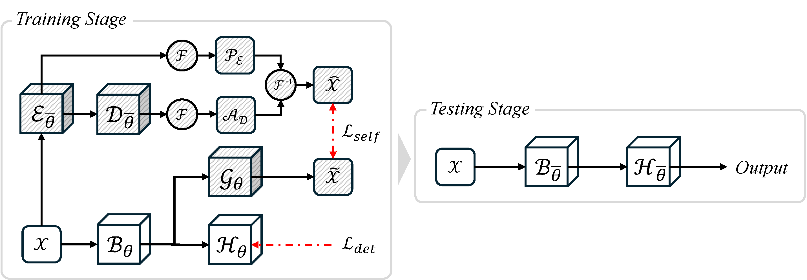

<div align="center">

<h1>SGLDet: Self-Guided Low Light Object Detection Framework</h1>

<p>
  <a href="https://openreview.net/forum?id=MGgAJ8yy2D">
    
  </a>
  <a href="https://gw-shin.github.io/sgldet-page/">
    
  </a>
  <a href="https://github.com/gw-shin/SGLDet">
    
  </a>
  <a href="LICENSE">
    
  </a>
</p>

<!-- arxiv badge: uncomment when available
  <a href="https://arxiv.org/abs/XXXX.XXXXX">
    
  </a>
-->

<br/>

[Gwangik Shin](https://www.linkedin.com/in/gwangik-shin/) · [Jaeha Song](https://www.linkedin.com/in/archiiive99/) · [Soonmin Hwang](https://soonminhwang.github.io/)†

Department of Automotive Engineering, Hanyang University

***ICLR 2026***

<br/>


</div>

---

## News

- [ ] Release pre-trained model weights
- [ ] Code coming soon
- [x] `2026.01.22`: Paper accepted at **ICLR 2026** 🎉

---

## Overview

Object detection in low-light environments is inherently challenging due to **limited contrast and heavy noise**, both of which significantly degrade feature representations. We propose a novel **self-guided low-light object detection framework** that effectively addresses these issues **without introducing additional parameters or increasing inference time**.

Our method incorporates a **detachable auxiliary pipeline** used only during training, consisting of:
- An **Enhancing Module** (ε) — self-supervised low-light image enhancement
- A **Denoising Module** (D) — self-supervised noise suppression
- A **Fourier-domain Fusion Block** (F, F⁻¹) — structure-preserving target image construction

This pipeline is **completely removed at inference time**, incurring no additional computational cost over the baseline detector.

<p align="center">
  
</p>

---

## Citation

If you find our work useful in your research, please consider citing our paper:

```bibtex
@inproceedings{shinself,
  title={Self-Guided Low Light Object Detection Framework},
  author={Shin, Gwangik and Song, Jaeha and Hwang, Soonmin},
  booktitle={The Fourteenth International Conference on Learning Representations}
}
```

---

## License

This software is released under the Apache 2.0 license. See [LICENSE](LICENSE) for details.

---

## Acknowledgement

This work was supported by the National Research Foundation of Korea (NRF) grant funded by the Korea government (MSIT) (No. RS-2024-00409492).
